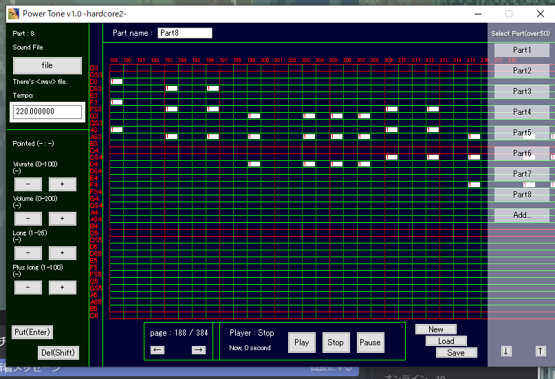

# power tone v1.0
basic dtm software released in 2015, when i were a 2nd junior-high school student.
awkward tempo optimization and simple sound design, but cool

## how to use
1. make projects
2. load sound file from ./sounds
3. draw midis and set volume and midi height
    * as once u set midi volume or pan thing, basically clicking another midi notes
    means coping the settings
4. play
5. save

